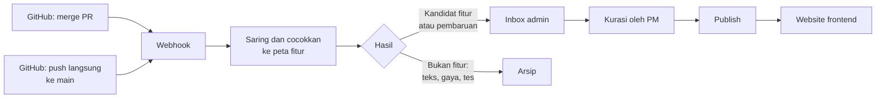

# Lapaq Playbook — Blueprint

Per 21 September 2026, diperbarui setelah audit repositori dan keputusan 26 September 2026. Salinan dari dokumen Blueprint di Claude Docs; jika ada perbedaan, dokumen asli menjadi acuan.

## Ringkasan dan tujuan

Lapaq Playbook adalah website panduan produk yang membuat tim marketing internal dan partner JV memahami Lapaq serta mengikuti fitur barunya tanpa pengetahuan teknis.

Lapaq adalah platform yang memungkinkan toko membuat website toko mereka sendiri. Video tutorial dinilai terlalu banyak dan panjang, sehingga dibutuhkan dokumen yang bisa dibaca dan selalu mutakhir.

Hub terdiri dari dua bagian: dashboard admin, tempat Product Manager mengurasi perubahan yang ditarik dari GitHub, dan website frontend, yang dibaca marketing dan partner. Ukuran keberhasilannya adalah waktu yang dibutuhkan marketing untuk memahami Lapaq dan fitur barunya.

## Keputusan yang sudah dikunci

Semua keputusan di bawah sudah dikonfirmasi dan menjadi acuan, kecuali model AI yang masih berupa pilihan awal.

**Dikonfirmasi**

| Aspek | Keputusan |
| --- | --- |
| Bentuk hasil | Dokumen yang bisa dibaca, bukan video tutorial |
| Arsitektur | Dashboard admin dan website frontend; perubahan ditarik otomatis dari GitHub, diatur di dashboard admin, lalu disajikan di frontend |
| Pemilik kurasi | Product Manager (pemilik proyek) |
| Audiens | Tim marketing internal dan partner JV |
| Bahasa | Indonesia |
| Screenshot | Otomatis lewat skrip sebagai pilihan utama; unggah manual sebagai pendukung |
| Teknologi Lapaq | Next.js |
| Toko demo | Sudah ada |
| Ukuran keberhasilan | Waktu yang dibutuhkan marketing untuk memahami Lapaq dan fitur barunya |

**Disetujui setelah review dan audit**

| Aspek | Keputusan |
| --- | --- |
| Hubungan dengan Lapaq | Proyek terpisah dari Lapaq, tetapi memakai Next.js dan gaya visual yang sama |
| Hosting | VPS sebagai pusat; Cloudflare R2 opsional untuk gambar dan GIF |
| Database | Di VPS, bukan Cloudflare D1 |
| Status konten | Internal, Beta, Siap diumumkan; default semua perubahan baru adalah Internal |
| Peran pengguna | Hanya Admin (Product Manager); peran Editor tidak dibuat |
| Alat screenshot | Playwright pada toko demo, dijalankan di VPS |
| Penarikan data GitHub | Webhook pada merge PR dan push ke main, bukan polling; repositori tidak memiliki rilis atau tag |
| Chatbot Tanya Lapaq | Ditunda ke fase 3 |
| Akses partner | Login dengan akun, bukan tautan privat |
| Bagian "Jangan dijanjikan" | Hanya tampil ke marketing internal, tidak ke partner |
| Model AI | Gemini 3.5 Flash Lite sebagai pilihan awal; belum final |
| Sumber perubahan | PR sebagai sumber utama; commit langsung ke main masuk daftar "perlu ditinjau" di inbox |
| Pengelompokan perubahan | Saring otomatis yang jelas bukan fitur, cocokkan ke peta fitur, dan kelompokkan lewat kunci "Fitur:" pada commit; Admin yang memutuskan |
| Penanda entri | Jenis (Fitur inti atau Add-on) dan Sifat (Baru atau Pembaruan) |
| Changelog dan roadmap Lapaq | Playbook berdiri sendiri; tidak menautkan atau mengimpornya |
| Format commit | Conventional Commits dengan trailer "Fitur:"; tim developer Lapaq bersedia memakainya dan mewajibkan PR untuk fitur |
| Tambah entri manual | Admin tetap bisa membuat entri secara manual dari dashboard ("Buat entri"); fitur ini tidak boleh dihapus atau digantikan oleh otomasi GitHub di fase mana pun |
| Akses marketing internal | Login dengan akun, sama seperti partner |
| Target waktu pemahaman | 10 menit untuk memahami satu fitur baru dari halamannya |
| Anggaran bulanan | Sekitar $20 per bulan untuk VPS dan pemakaian Gemini |

## Pengguna dan kebutuhan

Ada dua kelompok pembaca dan satu pengelola, dan para pembaca tidak memerlukan pengetahuan teknis.

| Peran | Siapa | Kebutuhan utama |
| --- | --- | --- |
| Admin | Product Manager | Melihat perubahan baru dari GitHub, memutuskan status dan audiens, menyunting draf, lalu publish dengan usaha sekecil mungkin |
| Tim marketing internal | Pembaca | Masuk dengan akun; memahami Lapaq dan fitur baru dengan cepat, tahu apa yang boleh dan tidak boleh dijanjikan, dan punya materi siap pakai |
| Partner JV | Pembaca eksternal | Memahami Lapaq, fitur yang tersedia, dan cara pakainya; masuk dengan akun dan hanya melihat konten yang ditandai untuk mereka, tanpa bagian "Jangan dijanjikan" |

Semua pembaca perlu bahasa sehari-hari, tampilan yang nyaman di ponsel, dan halaman yang singkat dengan satu topik per halaman.

## Ruang lingkup

Proyek ini hanya membangun hub untuk kurasi dan penyajian pengetahuan Lapaq; ia tidak menjadi platform dokumentasi umum dan tidak mengubah Lapaq itu sendiri.

**Termasuk**

- Dashboard admin untuk mengurasi perubahan, mengatur status dan audiens, dan mempublikasikan
- Website frontend untuk marketing dan partner JV, dalam bahasa Indonesia
- Penarikan perubahan dari repositori GitHub Lapaq, dengan draf penjelasan yang ditulis AI
- Screenshot otomatis dari toko demo lewat skrip, dengan unggah manual sebagai pendukung
- Pemisahan konten berdasarkan audiens: Internal saja, Marketing, Marketing dan Partner
- Pengukuran sederhana untuk ukuran keberhasilan

**Di luar cakupan**

- Platform mirip GitBook penuh: editor visual kompleks, komentar, multi-space, riwayat revisi tingkat lanjut
- Bahasa selain Indonesia
- Publikasi otomatis tanpa persetujuan admin
- Perubahan apa pun pada kode atau infrastruktur Lapaq

## Alur kerja dan aturan status

Setiap perubahan dari GitHub masuk sebagai draf berstatus Internal, dan hanya Admin yang bisa membuatnya terlihat oleh pembaca.

AI menyiapkan draf dan menyaring perubahan; keputusan status, audiens, dan publish selalu ada di tangan Admin.

**Status kesiapan (nama masih usulan)**

| Status | Arti |
| --- | --- |
| Internal | Default untuk semua draf baru; belum boleh dibicarakan ke luar tim |
| Beta | Sudah bisa dicoba tetapi terbatas; boleh disebut dengan hati-hati |
| Siap diumumkan | Sudah stabil dan boleh dipromosikan |

**Audiens**

| Audiens | Yang bisa melihat |
| --- | --- |
| Internal saja | Admin |
| Marketing | Admin dan tim marketing |
| Marketing dan Partner | Admin, tim marketing, dan partner JV |

**Aturan**

1. Draf baru selalu berstatus Internal dan beraudiens Internal saja; kalau ada yang terlupa, akibatnya hanya keterlambatan, bukan kebocoran.
2. Hanya Admin yang dapat mengubah status, mengubah audiens, dan mempublikasikan.
3. Pembaca hanya melihat konten yang sudah dipublikasikan dan audiensnya mencakup mereka.
4. Setiap halaman fitur memuat bagian "Boleh dijanjikan" dan "Jangan dijanjikan", yang diisi Admin sebelum publish; bagian "Jangan dijanjikan" hanya tampil ke marketing internal.
5. Setiap perubahan konten tercatat: siapa yang mengubah dan kapan.

### Cara sistem membedakan fitur dari perubahan lain

Satu commit tidak sama dengan satu fitur selesai, jadi sistem tidak menebak kapan fitur selesai; ia mengumpulkan sinyal, membuat kandidat, dan Admin memutuskan.

**Saring otomatis**

| Sinyal | Hasil |
| --- | --- |
| Tipe commit copy, docs, test, chore, atau style | Arsip |
| Perubahan hanya menyentuh CSS atau teks tampilan | Arsip |
| Tipe commit fix | Daftar perbaikan terpisah yang jarang ditinjau |
| File page.tsx atau route.ts baru, atau tabel dan kolom baru | Kandidat fitur baru |
| Perubahan di src/services/add-ons atau komponen add-on | Kandidat add-on |

**Pencocokan ke peta fitur.** Peta fitur awal dibuat sekali dari struktur route dan modul Lapaq. Perubahan yang cocok dengan entri yang ada menjadi Pembaruan entri itu, sedangkan yang tidak cocok menjadi Kandidat fitur baru. Satu fitur yang dikerjakan lewat banyak commit tetap menjadi satu kandidat yang bertambah isinya, dan tidak tampil ke pembaca sebelum Admin menandainya selesai.

**Penanda entri.** Setiap entri punya Jenis (Fitur inti atau Add-on) dan Sifat (Baru atau Pembaruan). AI mengusulkannya dari jalur file, lalu Admin mengonfirmasi di editor.

**Pengelompokan lewat commit.** Kunci utamanya adalah trailer "Fitur: slug-fitur" pada commit bertipe feat. Commit tanpa kunci dikelompokkan berdasarkan usulan AI dan dikoreksi Admin. Tebakan Jenis dari jalur file belum teruji dan harus divalidasi di repositori sebelum fase 2.

## Arsitektur dan teknologi

Hub dibangun sebagai satu aplikasi Next.js terpisah dari Lapaq, berjalan di VPS, dengan tujuh komponen (pilihan teknologi sudah disetujui, kecuali model AI yang masih pilihan awal).

| Komponen | Fungsi | Pilihan |
| --- | --- | --- |
| Website frontend | Halaman untuk marketing dan partner (partner masuk dengan akun) | Next.js |
| Dashboard admin | Inbox, editor, status, audiens, publish | Next.js, area terlindungi login |
| Database | Menyimpan entri, status, audiens, riwayat perubahan | Database di VPS |
| Penyimpanan media | Screenshot, GIF, gambar promosi | Disk VPS; Cloudflare R2 opsional |
| Penerima webhook GitHub | Menerima kabar merge PR dan push ke main dari repositori Lapaq | Endpoint di aplikasi yang sama |
| Penulis draf AI | Mengubah judul dan deskripsi PR, pesan commit, dan daftar file menjadi draf penjelasan, langkah pakai, dan entri changelog | Gemini 3.5 Flash Lite (pilihan awal) |
| Pengambil screenshot | Membuka toko demo, menjalankan skenario per fitur, mengambil gambar | Playwright di VPS |

**Prinsip yang dijaga**

- Sistem memakai token GitHub yang hanya bisa membaca, dan AI hanya menerima judul dan deskripsi PR, pesan commit, dan ringkasan perubahan (bukan seluruh kode).
- Rahasia (file .env, kunci API) dan data pelanggan tidak boleh ikut terkirim ke AI.
- Jika skenario screenshot gagal karena tampilan Lapaq berubah, sistem menandai "screenshot gagal diperbarui" dan tidak menampilkan gambar lama secara diam-diam; unggah manual menjadi cadangan.
- Setiap fitur memerlukan satu skenario screenshot, yang draf awalnya dibuat AI lalu dicoba dan dikoreksi sekali.
- Toko demo harus stabil, karena skenario screenshot bergantung padanya.

## Spesifikasi dashboard admin dan website frontend

Dashboard memusatkan semua keputusan, dan website menampilkan hasilnya sebagai panduan produk yang visual, singkat, dan mudah dipahami tanpa latar teknis.

### Dashboard admin

| Halaman | Fungsi |
| --- | --- |
| Inbox | Draf baru dari GitHub yang menunggu keputusan, dikelompokkan per fitur dan berlabel hasil triase, ditambah daftar commit langsung ke main yang perlu ditinjau |
| Editor entri | Tiga bagian: penjelasan fitur, panduan pakai, materi marketing; termasuk unggah screenshot manual |
| Pengaturan publikasi | Status, audiens, bagian Boleh dan Jangan dijanjikan, serta jadwal publish |
| Preview | Melihat halaman persis seperti yang dilihat pembaca |
| Persetujuan cepat | Satu klik Publish untuk draf yang sudah bagus, tanpa membuka editor |
| Arsip | Perubahan yang disaring otomatis, seperti bug kecil dan refactor |
| Riwayat | Siapa mengubah apa dan kapan |
| Pengguna | Mengelola akun Admin dan akun partner |

### Website frontend

| Halaman | Isi |
| --- | --- |
| Beranda | Sapaan singkat, tiga tombol tujuan ("Saya ingin tahu yang baru", "Saya ingin belajar cara pakai", "Saya butuh materi promosi"), dan kartu "Baru minggu ini" |
| Apa yang baru | Daftar perubahan dalam bahasa manfaat, dengan badge status |
| Katalog fitur | Kartu berikon yang bisa difilter berdasarkan kebutuhan pelanggan, bukan nama modul |
| Halaman fitur | Template yang sama untuk semua fitur (lihat di bawah) |
| Panduan skenario | Misalnya "Menunjukkan Lapaq ke calon pelanggan dalam 10 menit" |

**Template halaman fitur**

1. Ringkasan satu kalimat dan badge status
2. Untuk toko seperti apa fitur ini berguna
3. Masalah yang diselesaikan
4. Cara kerja, dalam GIF 30 sampai 60 detik atau langkah bergambar
5. Cara pakai, tiga sampai lima langkah bernomor
6. Boleh dijanjikan dan jangan dijanjikan (bagian jangan dijanjikan hanya tampil ke marketing internal)
7. Materi siap pakai: teks promosi yang bisa disalin dan gambar yang bisa diunduh
8. Pertanyaan yang sering diajukan calon pelanggan, beserta jawabannya
9. Tanggal pembaruan terakhir

Setiap halaman juga memiliki tombol "Coba di toko demo" dan pertanyaan "Apakah halaman ini membantu?", yang datanya dipakai untuk ukuran keberhasilan.

**Prinsip tampilan**

- Visual dulu, teks sesudahnya; satu kalimat per langkah
- Satu halaman untuk satu topik
- Bahasa sehari-hari; istilah teknis diganti padanan awam atau dijelaskan lewat tooltip
- Nyaman dibuka di ponsel

## Model data garis besar

Sembilan entitas cukup untuk seluruh alur; field dirinci saat implementasi.

| Entitas | Field utama |
| --- | --- |
| Entri fitur | Judul, ringkasan satu kalimat, penjelasan, cocok untuk toko seperti apa, masalah yang diselesaikan, status, audiens, boleh dijanjikan, jangan dijanjikan, tag kebutuhan pelanggan, jenis (fitur inti atau add-on), sifat (baru atau pembaruan), slug fitur, tanggal publish, tanggal pembaruan |
| Langkah panduan | Entri, urutan, teks langkah, media terkait |
| Media | Entri, jenis (screenshot, GIF, gambar promosi), sumber (otomatis atau manual), file, penanda "gagal diperbarui" |
| Skenario screenshot | Entri, langkah skrip, hasil terakhir, waktu jalan terakhir |
| Perubahan GitHub | Nomor PR atau commit, tipe commit, area, judul, deskripsi, tanggal merge, hasil triase, entri terkait |
| Pengguna | Nama, peran, akses |
| Akses partner | Nama partner, akun login, aktif atau tidak |
| Riwayat perubahan | Entri, pengguna, waktu, ringkasan perubahan |
| Umpan balik halaman | Entri, membantu atau tidak, waktu |

## Tahapan pembangunan

Pembangunan berjalan dalam tiga fase, dan otomasi baru ditambahkan setelah alur kurasi manual terbukti nyaman dipakai.

| Fase | Isi | Selesai jika |
| --- | --- | --- |
| 1. Kurasi manual | Dashboard (login, editor entri, status, audiens, preview, publish, riwayat); website (beranda, apa yang baru, katalog, halaman fitur, panduan skenario); unggah screenshot manual; akun login partner; tombol umpan balik; peta fitur awal dari hasil audit sebagai entri berstatus Internal | PM dapat membuat dan mempublikasikan satu fitur dari nol, dan seorang anggota marketing memahaminya dari halaman itu tanpa bertanya ke developer |
| 2. Otomasi | Webhook GitHub (merge PR dan push ke main); draf AI yang mencocokkan perubahan ke entri; triase dan arsip; inbox admin; screenshot otomatis dari toko demo dengan penanda gagal | Sebuah merge di repositori Lapaq muncul sebagai draf di inbox lengkap dengan screenshot, dan PM dapat menerbitkannya dalam satu sesi review |
| 3. Kenyamanan | Ringkasan mingguan ke marketing; penanda "baru sejak kunjunganmu"; ekspor PDF; chatbot Tanya Lapaq | Marketing mengetahui perubahan baru tanpa harus membuka hub, dan chatbot hanya menjawab dari isi hub dengan menautkan halaman sumbernya |

Mockup beranda dan halaman fitur sudah dibuat sebagai prototipe klik dan disetujui Product Manager pada 21 September 2026.

## Ukuran keberhasilan

Ukuran utamanya adalah waktu yang dibutuhkan tim marketing untuk memahami Lapaq dan fitur barunya; dua ukuran pendukung membantu menjelaskan penyebabnya.

| Ukuran | Peran | Cara memantau |
| --- | --- | --- |
| Waktu marketing memahami Lapaq dan fitur baru (target 10 menit per fitur) | Utama | Mencatat waktu onboarding anggota marketing baru, serta waktu memahami fitur baru, sebelum dan sesudah hub dipakai (manual) |
| Halaman dinilai membantu | Pendukung | Tombol "Apakah halaman ini membantu?" di setiap halaman fitur (otomatis) |
| Pertanyaan marketing ke developer per bulan | Pendukung | Dicatat manual |

Targetnya 10 menit untuk memahami satu fitur baru dari halamannya (ditetapkan Product Manager, 26 September 2026).

## Risiko dan mitigasinya

Risiko terbesar bukan pada teknologi, melainkan pada kurasi: kalau PM menjadi satu-satunya penyaring dan prosesnya berat, hub akan basi.

| Risiko | Mitigasi |
| --- | --- |
| Kurasi tertunda dan hub menjadi basi | Triase AI, ringkasan mingguan, persetujuan satu klik, pengingat untuk draf yang menunggu lebih dari seminggu |
| Inbox menumpuk | Bug kecil dan refactor otomatis masuk arsip |
| Fitur setengah jadi terbaca seperti fitur siap | Semua draf berstatus Internal secara default; hanya Admin yang mengubah status |
| Satu commit tidak sama dengan satu fitur | Kunci "Fitur:" pada commit, pencocokan ke peta fitur, saring otomatis, dan koreksi rutin oleh Admin; tim Lapaq sudah setuju memakai format commit dan mewajibkan PR untuk fitur |
| Perubahan tidak tertangkap otomasi (commit tanpa format, fitur tanpa PR) | Admin tetap bisa menambah entri secara manual dari dashboard |
| Detail internal atau rahasia terbawa ke AI atau ke partner | Token GitHub hanya-baca; AI hanya menerima judul dan deskripsi PR, pesan commit, dan ringkasan perubahan (bukan seluruh kode); kontrol audiens; review sebelum publish |
| Screenshot rusak saat tampilan Lapaq berubah | Penanda "gagal diperbarui" dan cadangan unggah manual |
| Toko demo berubah atau tidak stabil | Isi toko demo dijaga stabil karena skenario screenshot bergantung padanya |

## Hasil audit repositori

Audit hanya-baca terhadap repositori bajaklautmalaka/lapaq (21 September 2026) menjawab pertanyaan tentang label dan penamaan PR, dan mengubah beberapa asumsi dokumen ini. Laporan lengkapnya ada di audit/github-pr-audit.md.

| Aspek | Temuan | Dampak pada rancangan |
| --- | --- | --- |
| Label PR | 0 dari 7 PR berlabel | Triase tidak bisa mengandalkan label |
| Feature flag | Tidak ada sistem umum dan tidak ada tahap Beta | Status Internal, Beta, dan Siap diumumkan dimiliki Playbook |
| Deskripsi PR | 4 dari 7 kosong | Draf AI harus tetap berguna dari judul dan daftar file |
| Rilis dan tag | Tidak ada | Pemicu memakai merge PR dan push ke main, bukan release |
| Commit langsung | 62 commit langsung berbanding 7 PR; 28 commit berpesan tiga kata atau kurang | Push langsung masuk daftar perlu ditinjau; format commit diusulkan ke tim Lapaq |
| Ukuran PR | Satu PR sering berisi banyak fitur (PR #7 berisi lima butir) | AI memecah satu PR menjadi beberapa usulan entri |
| Changelog dan roadmap | Lapaq sudah punya halaman changelog dan roadmap sendiri | Playbook berdiri sendiri dan tidak menautkan atau mengimpornya |

## Pertanyaan terbuka

Semua pertanyaan sudah terjawab.

- [x] Apakah tim developer Lapaq memakai label PR atau feature flag, dan seberapa rapi penamaan PR-nya? Tidak ada label maupun sistem feature flag, dan penamaan campur (audit 21 September 2026)
- [x] Apakah delapan rekomendasi pada bagian Keputusan disetujui? Ya, dengan penyesuaian: peran Editor tidak dibuat
- [x] Apakah bagian "Jangan dijanjikan" boleh terlihat oleh partner? Tidak, hanya marketing internal
- [x] Apakah partner memakai tautan privat atau akun? Akun
- [x] Siapa yang menjadi Editor? Tidak diperlukan, Product Manager menangani semuanya
- [x] Apa sumber perubahan setelah audit? PR sebagai sumber utama, commit langsung ke main masuk daftar perlu ditinjau
- [x] Apakah changelog dan roadmap Lapaq ditautkan? Tidak, Playbook berdiri sendiri
- [x] Kapan mockup dibuat? Prototipe klik sudah dibuat dan disetujui
- [x] Berapa angka dasar waktu marketing memahami fitur sebelum hub, dan berapa targetnya? Target 10 menit (26 September 2026)
- [x] Berapa perkiraan biaya bulanan untuk hosting, database, dan pemakaian AI? Sekitar $20 per bulan untuk VPS dan Gemini (26 September 2026)
- [x] Apakah tim marketing internal juga masuk lewat akun, atau cukup dengan cara lain? Ya, lewat akun (26 September 2026)
- [x] Apakah tim developer Lapaq bersedia memakai format commit yang diusulkan dan mewajibkan PR untuk fitur? Ya, dengan syarat fitur tambah entri manual tetap dipertahankan (26 September 2026)
